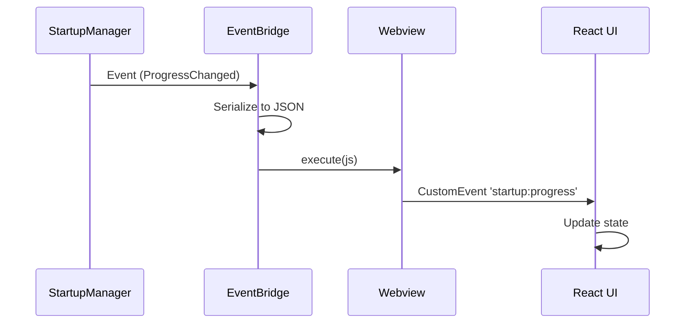

# Bridge Module Guide

The bridge module provides communication between the C++ backend and the JavaScript/React frontend, forwarding events as DOM CustomEvents that the UI can subscribe to.

## Overview

The bridge uses the [saucer](https://saucer.github.io/) webview library to execute JavaScript in the embedded browser. Events from C++ modules (like StartupManager) are:

1. Serialized to JSON
2. Wrapped in a JavaScript `CustomEvent`
3. Dispatched via `window.dispatchEvent()`



## Event Types

### Startup Events

When connected to a StartupManager, the bridge forwards these events:

| C++ Event | JS Event Name | Payload |
|-----------|---------------|---------|
| `ProgressChanged` | `startup:progress` | Full `SequenceProgress` object |
| `StateChanged` | `startup:state` | `{old_state: number, new_state: number}` |
| `StepStarted` | `startup:step_started` | `{index: number, id: string}` |
| `StepCompleted` | `startup:step_completed` | `{index: number, id: string, status: number}` |
| `SequenceCompleted` | `startup:completed` | `{success: boolean, error: string}` |
| `Error` | `startup:error` | `{message: string}` |

### Event Payloads

#### SequenceProgress (startup:progress)

```typescript
interface SequenceProgress {
    state: number;              // AppState enum (0=Off, 1=Booting, 2=Active, 3=ShuttingDown)
    current_step_index: number; // Currently running step (-1 if none)
    steps: StepProgress[];      // All steps with their progress
    last_error: string | null;  // Error message if failed
    can_retry: boolean;         // True if retry is allowed
    abort_reason: number;       // AbortReason enum
}

interface StepProgress {
    id: string;
    display_name: string;
    status: number;             // StepStatus enum
    message: string;
    start_time: number | null;  // Milliseconds since epoch
    end_time: number | null;
}
```

#### Enum Values

**AppState:**

- 0: Off
- 1: Booting
- 2: Active
- 3: ShuttingDown

**StepStatus:**

- 0: Pending
- 1: Running
- 2: Success
- 3: Failed
- 4: TimedOut
- 5: Skipped
- 6: Aborted

**AbortReason:**

- 0: None
- 1: UserRequested
- 2: Timeout
- 3: CriticalFailure
- 4: SystemShutdown

## Frontend Integration

### React Hook Example

```typescript
// hooks/useStartupEvents.ts
import { useState, useEffect, useCallback } from 'react';

interface SequenceProgress {
    state: number;
    current_step_index: number;
    steps: StepProgress[];
    last_error: string | null;
    can_retry: boolean;
    abort_reason: number;
}

export function useStartupEvents() {
    const [progress, setProgress] = useState<SequenceProgress | null>(null);

    useEffect(() => {
        const handleProgress = (e: CustomEvent<SequenceProgress>) => {
            setProgress(e.detail);
        };

        const handleCompleted = (e: CustomEvent<{success: boolean, error: string}>) => {
            console.log('Startup completed:', e.detail.success ? 'success' : e.detail.error);
        };

        const handleError = (e: CustomEvent<{message: string}>) => {
            console.error('Startup error:', e.detail.message);
        };

        window.addEventListener('startup:progress', handleProgress as EventListener);
        window.addEventListener('startup:completed', handleCompleted as EventListener);
        window.addEventListener('startup:error', handleError as EventListener);

        return () => {
            window.removeEventListener('startup:progress', handleProgress as EventListener);
            window.removeEventListener('startup:completed', handleCompleted as EventListener);
            window.removeEventListener('startup:error', handleError as EventListener);
        };
    }, []);

    return progress;
}
```

### React Component Example

```tsx
// components/StartupStatus.tsx
import { useStartupEvents } from '../hooks/useStartupEvents';

const StepStatus = {
    Pending: 0,
    Running: 1,
    Success: 2,
    Failed: 3,
    TimedOut: 4,
    Skipped: 5,
    Aborted: 6,
};

export function StartupStatus() {
    const progress = useStartupEvents();

    if (!progress) {
        return <div>Waiting for startup...</div>;
    }

    return (
        <div className="startup-status">
            {progress.steps.map((step, index) => (
                <div key={step.id} className="step">
                    <span className="step-name">{step.display_name}</span>
                    <span className={`status status-${step.status}`}>
                        {step.status === StepStatus.Running && 'Running...'}
                        {step.status === StepStatus.Success && 'Success!'}
                        {step.status === StepStatus.Failed && 'Failed!'}
                        {step.status === StepStatus.Pending && 'Pending...'}
                    </span>
                    {step.message && <span className="message">{step.message}</span>}
                </div>
            ))}
            
            {progress.last_error && (
                <div className="error">{progress.last_error}</div>
            )}
            
            {progress.can_retry && (
                <button onClick={() => window.aknet?.retry()}>Retry</button>
            )}
        </div>
    );
}
```

## C++ Usage

### Basic Setup

The bridge is typically initialized by the core module:

```cpp
// In core initialization
auto bridge_logger = log::get("bridge");
bridge_ = std::make_unique<bridge::EventBridge>(bridge_logger, webview);
bridge_->connect_startup_events(startup_manager_);
```

### Lifecycle Management

```cpp
// Connect
bridge.connect_startup_events(manager1);

// Reconnect to different manager (auto-disconnects first)
bridge.connect_startup_events(manager2);

// Manual disconnect
bridge.disconnect();

// Safe to call multiple times
bridge.disconnect();
bridge.disconnect();

// Destructor auto-disconnects
```

## Testing

The bridge is designed for testability using a mock webview:

```cpp
class MockWebview {
public:
    std::vector<std::string> executed_js;
    
    void execute(const std::string& js) {
        executed_js.push_back(js);
    }
    
    bool has_event(const std::string& event_name) const {
        for (const auto& js : executed_js) {
            if (js.find(event_name) != std::string::npos) {
                return true;
            }
        }
        return false;
    }
};

TEST_CASE("Bridge forwards progress events") {
    MockWebview webview;
    auto logger = log::get("test");
    
    bridge::EventBridge bridge(logger, &webview);
    bridge.connect_startup_events(manager);
    
    // Run startup...
    manager->start_async();
    // Wait for completion...
    
    REQUIRE(webview.has_event("startup:progress"));
    REQUIRE(webview.has_event("startup:completed"));
}
```

## Thread Safety

| Operation | Thread Safety |
|-----------|---------------|
| Construction | Main thread only |
| `connect_startup_events()` | Main thread only |
| `disconnect()` | Main thread only |
| Event callbacks | Safe from worker threads |

The EventBridge itself is not thread-safe, but it safely handles events fired from worker threads (like StartupManager's worker thread) because:

1. Events are received via callbacks
2. The webview's `execute()` method queues JavaScript execution
3. JavaScript execution happens on the main/UI thread

## Extending the Bridge

To add support for other event sources, follow this pattern:

```cpp
// In bridge.h
void connect_audio_events(std::shared_ptr<audio::AudioEngine> engine);

// In bridge.cpp
void EventBridge::connect_audio_events(
    std::shared_ptr<audio::AudioEngine> engine)
{
    // Disconnect existing audio listeners if any
    // ...
    
    // Subscribe to audio events
    engine->events().get<AudioEngine::Event::BufferUnderrun>()
        .add([this](int channel) {
            json j = {{"channel", channel}};
            std::string js = std::format(
                "window.dispatchEvent(new CustomEvent('audio:underrun', "
                "{{detail: {}}}));",
                j.dump()
            );
            execute_fn_(js);
        });
    
    // Store for cleanup
    // ...
}
```

## API Reference

See the auto-generated API documentation:

- [EventBridge](../aknet/bridge/EventBridge.md) - Main bridge class
- [bridge namespace](../aknet/bridge/index.md) - Module overview
