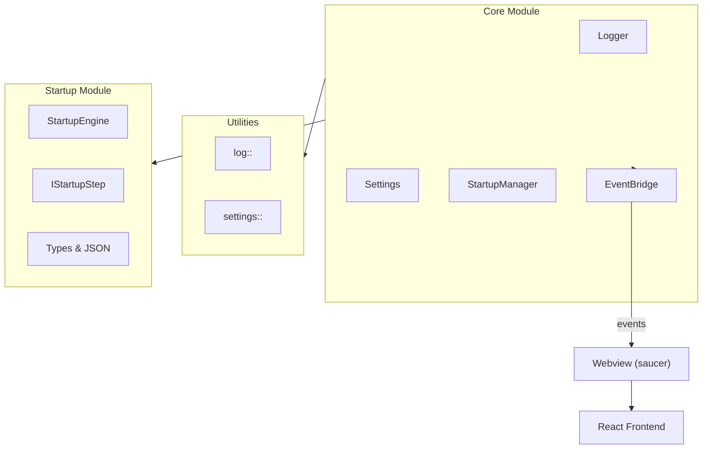

# Guides

Documentation and tutorials for aknet modules and features.

## Module Guides

| Guide | Description |
|-------|-------------|
| [Core Module](core-module.md) | Central orchestrator and application lifecycle |
| [Bridge Module](bridge-module.md) | C++ to JavaScript event communication |
| [Startup Module](startup-module.md) | Application initialization sequence management |

## Architecture Overview

aknet is organized into modular components:

## Getting Started

1. **[Core Module](core-module.md)** - Start here to understand how the application is structured
2. **[Startup Module](startup-module.md)** - Learn about the initialization sequence
3. **[Bridge Module](bridge-module.md)** - Understand C++ to JS communication
