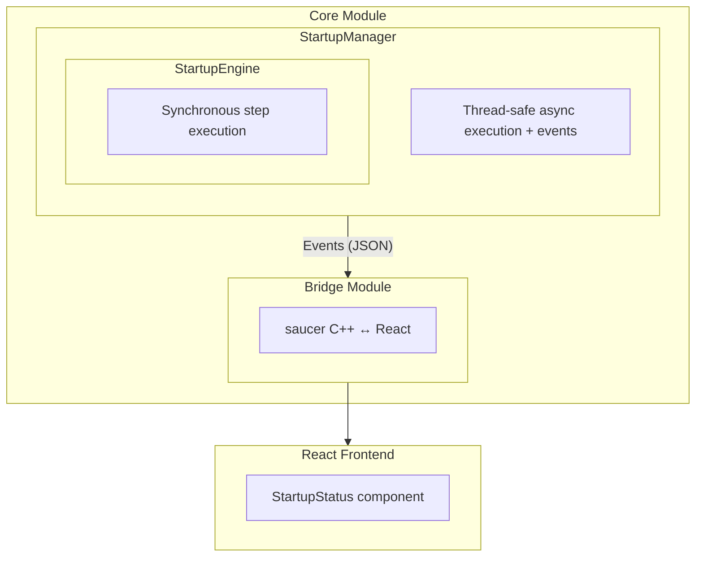

# Startup Module Guide

The startup module manages the application initialization sequence, taking aknet from an idle state to fully operational with all systems running.

## Overview

When the user starts aknet, it needs to perform several tasks in a certain order, like:

- Check that JACK audio server is installed
- Discover NMOS registries on the network
- Connect to a registry
- Load available audio devices
- Initialize the audio engine

The startup module provides a framework for defining, executing, and monitoring these steps with:

- **Configurable steps** with timeouts and criticality flags
- **Real-time progress updates** for the UI
- **Abort handling** for user cancellation
- **Retry logic** for recoverable failures
- **Async execution** with thread-safe state access

## Architecture



## Key Concepts

### Application State

The app transitions through these states during startup:

| State | Description |
|-------|-------------|
| `Off` | Idle - startup hasn't begun or has failed |
| `Booting` | Startup sequence is executing |
| `Active` | Startup succeeded, app is fully operational |
| `ShuttingDown` | App is shutting down |

### Step Configuration

Each step has these properties:

| Property | Type | Description |
|----------|------|-------------|
| `id` | string | Unique identifier (used in logs and JSON) |
| `display_name` | string | Human-readable name for UI |
| `timeout` | seconds | Max execution time (0 = no limit) |
| `critical` | bool | If true, failure stops the entire sequence |
| `can_skip` | bool | If true, step can be skipped |

### Step Status

Individual steps progress through these states:

| Status | Description |
|--------|-------------|
| `Pending` | Not started yet |
| `Running` | Currently executing |
| `Success` | Completed successfully |
| `Failed` | Failed (check message for details) |
| `TimedOut` | Exceeded configured timeout |
| `Skipped` | Was skipped |
| `Aborted` | User requested abort |

### Critical vs Non-Critical Steps

- **Critical steps**: If a critical step fails, times out, or is aborted, the entire sequence stops and `can_retry` is set to `true`.
- **Non-critical steps**: Failure is logged but the sequence continues to the next step.

## Usage from Core

### 1. Create and Configure StartupManager

```cpp
#include <startup_manager.h>
#include <steps_definition.h>

// In Core initialization:
startup_manager_ = std::make_unique<startup::StartupManager>(
    logger_,
    settings_
);

// Register the startup steps
startup_manager_->set_steps(startup::create_default_steps());
```

### 2. Subscribe to Events

```cpp
// Progress updates (for UI)
startup_manager_->events().get<startup::StartupManager::Event::ProgressChanged>()
    .on([this](const startup::SequenceProgress& progress) {
        // Serialize and send to UI
        auto json = startup::serialize_progress(progress);
        bridge_->send_startup_progress(json);
    });

// State changes
startup_manager_->events().get<startup::StartupManager::Event::StateChanged>()
    .on([this](startup::AppState old_state, startup::AppState new_state) {
        logger_->info("State changed: {} -> {}", 
            static_cast<int>(old_state), 
            static_cast<int>(new_state));
        
        if (new_state == startup::AppState::Active) {
            // Startup complete - show main UI
            bridge_->show_main_view();
        }
    });

// Completion
startup_manager_->events().get<startup::StartupManager::Event::SequenceCompleted>()
    .on([this](bool success, const std::string& error) {
        if (!success) {
            logger_->error("Startup failed: {}", error);
            // Show error in UI
            bridge_->show_startup_error(error);
        }
    });

// Errors
startup_manager_->events().get<startup::StartupManager::Event::Error>()
    .on([this](const std::string& error) {
        logger_->error("Startup error: {}", error);
    });
```

### 3. Start the Sequence

```cpp
auto result = startup_manager_->start_async();
if (!result.ok) {
    logger_->error("Failed to start: {}", result.error);
}
```

### 4. Handle User Actions

```cpp
// User clicks Cancel
void Core::on_user_cancel_startup() {
    startup_manager_->request_abort(startup::AbortReason::UserRequested);
}

// User clicks Retry
void Core::on_user_retry_startup() {
    if (startup_manager_->can_retry()) {
        startup_manager_->retry_async();
    }
}
```

## Creating Custom Steps

### Basic Step

```cpp
#include <startup_step.h>

class MyCustomStep : public startup::IStartupStep {
    startup::StepConfig config_{
        .id = "my_step",
        .display_name = "My Custom Step",
        .timeout = std::chrono::seconds{10},
        .critical = true,
        .can_skip = false
    };

public:
    const startup::StepConfig& config() const override {
        return config_;
    }

    startup::StepResult run(startup::StepContext& ctx) override {
        ctx.logger->info("Starting my custom step...");
        
        // Do your work here
        bool success = do_something();
        
        if (success) {
            return {startup::StepStatus::Success, "Completed successfully"};
        } else {
            return {startup::StepStatus::Failed, "Something went wrong"};
        }
    }
};
```

### Step with Abort Checking

For long-running operations, check for abort periodically:

```cpp
startup::StepResult run(startup::StepContext& ctx) override {
    for (int i = 0; i < 100; ++i) {
        // Check if user requested abort
        if (ctx.abort_requested()) {
            return {startup::StepStatus::Aborted, "Cancelled by user"};
        }
        
        // Check if timeout exceeded
        if (ctx.is_expired()) {
            return {startup::StepStatus::TimedOut, "Operation took too long"};
        }
        
        do_work_chunk(i);
    }
    
    return {startup::StepStatus::Success, "All done"};
}
```

### Step with Exception-Based Abort

Use `check_abort_point()` for exception-based abort handling:

```cpp
startup::StepResult run(startup::StepContext& ctx) override {
    try {
        for (int i = 0; i < 100; ++i) {
            ctx.check_abort_point();  // Throws if abort requested
            do_work_chunk(i);
        }
        return {startup::StepStatus::Success, "Completed"};
    } catch (const std::runtime_error& e) {
        return {startup::StepStatus::Aborted, e.what()};
    }
}
```

## Integration with UI (React)

### Receiving Progress Updates

The frontend receives JSON-serialized `SequenceProgress` objects:

```typescript
interface SequenceProgress {
  state: number;           // AppState enum
  current_step_index: number;
  steps: StepProgress[];
  last_error: string | null;
  can_retry: boolean;
  abort_reason: number;    // AbortReason enum
}

interface StepProgress {
  id: string;
  display_name: string;
  status: number;          // StepStatus enum
  message: string;
  start_time: number | null;  // ms since epoch
  end_time: number | null;
}
```

### Example React Component

```tsx
function StartupStatus({ progress }: { progress: SequenceProgress }) {
  return (
    <div>
      {progress.steps.map((step, index) => (
        <div key={step.id}>
          <span>{step.display_name}</span>
          <StatusBadge status={step.status} />
          {step.status === StepStatus.Running && <Spinner />}
        </div>
      ))}
      
      {progress.last_error && (
        <ErrorMessage>{progress.last_error}</ErrorMessage>
      )}
      
      {progress.can_retry && (
        <Button onClick={onRetry}>Retry</Button>
      )}
    </div>
  );
}
```

## Thread Safety

| Component | Thread Safety |
|-----------|---------------|
| `StartupEngine` | Not thread-safe (single-threaded only) |
| `StartupManager` | Fully thread-safe |
| Progress queries | Return copies, safe from any thread |
| Events | Fire from worker thread - handlers must be thread-safe |

!!! warning "Event Handler Thread Safety"
    Events fire from the StartupManager's worker thread, not the main thread.
    If your handler updates UI or shared state, ensure proper synchronization.

## Error Handling

### Types of Failures

1. **Critical step failure**: Sequence stops, `can_retry=true`
2. **Non-critical step failure**: Logged, sequence continues
3. **Timeout**: Treated like failure (critical/non-critical based on config)
4. **User abort**: Sequence stops, `can_retry=false`
5. **System shutdown**: Sequence stops, `can_retry=false`

### Retry Logic

Retry is only allowed when:

- State is `Off` (not currently running)
- `can_retry` is `true` (set after critical failure, NOT after user abort)

```cpp
if (startup_manager_->can_retry()) {
    auto result = startup_manager_->retry_async();
    if (!result.ok) {
        // Handle error
    }
}
```

## Testing

The module includes test utilities:

- `FakeClock`: Mock clock for testing timeout behavior without real delays
- `FakeStep`: Configurable step for testing various scenarios
- `SlowStep`, `FailingStep`: Pre-configured test steps

Example test:

```cpp
TEST_CASE("Startup sequence completes successfully") {
    EngineTestFixture f;
    StartupEngine engine(f.logger, f.settings, f.clock);
    
    std::vector<StartupEngine::StepPtr> steps;
    steps.push_back(std::make_unique<FakeStep>(
        StepConfig{.id = "step1", .display_name = "Step 1"},
        StepResult{StepStatus::Success, "OK"}
    ));
    
    engine.set_steps(std::move(steps));
    const auto& progress = engine.run({});
    
    REQUIRE(progress.state == AppState::Active);
}
```

## API Reference

See the auto-generated API documentation:

- [Startup Types](../aknet/startup/types/index.md) - Core types and enums
- [Startup Steps](../aknet/startup/steps/index.md) - Step interface and context
- [StartupManager](../aknet/startup/manager/StartupManager.md) - Async manager
- [StartupEngine](../aknet/startup/engine/StartupEngine.md) - Synchronous engine
- [Startup JSON](../aknet/startup/json/index.md) - JSON serialization
- [Step Implementations](../aknet/startup/impl/index.md) - Placeholder steps
